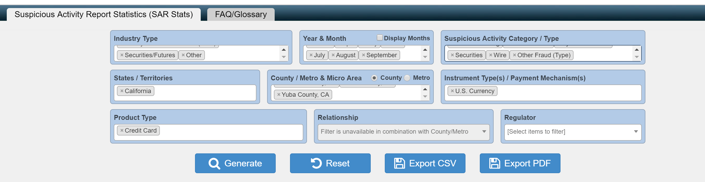

```{r setup, include=FALSE}
knitr::opts_chunk$set(echo = TRUE)
```

## Readme
   
  We are using the data from:
```{r}
  head(read.csv("SARStats.csv") )
```
  

  This is how we generated the dataset:
  
  


##Jianhao's Plot


## Xuan's plot
  As we get a lot of regions here, it is hard to put all the information on the same plot. So I randomly picked 4 counties: ("Los Angeles County, CA","Santa Clara County, CA","Orange County, CA","Santa Barbara County, CA"). 

  I don't want the text to be overlapped with each other, so I switch the direction of x-axis and y-axis. Now the x-axis becomes vertical and the y-axis becomes horizontal.
  
  Position = "dodge" places overlapping objects directly beside one another. This makes it easier to compare individual values.
  
```{r}
library(dplyr)
OriginData <- read.csv("SARStats.csv") 
OriginData$Count <- as.numeric(OriginData$Count)
xuan <-OriginData %>%
  group_by(Industry,Countym)%>%
  summarise(n=sum(Count))%>%
  filter(Industry != '[Total]' & Countym %in% c("Los Angeles County, CA","Santa Clara County, CA","Orange County, CA","Santa Barbara County, CA")) %>%
  arrange(desc(n))
ggplot(data=xuan,mapping=aes(x=Countym,y=n),group=factor(1),xlab(Countym))+ 
          geom_bar(position = "dodge",aes(fill=Industry),stat = "Identity")+
          theme(axis.text.x = element_text(angle = 90, hjust = 0.5, vjust = 0.5))+
          coord_flip()
          
```

##Discussion & Conclusion

   
