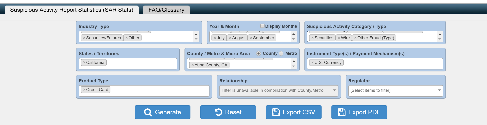

```{r setup, include=FALSE}
knitr::opts_chunk$set(echo = TRUE)
library(dplyr)
library(tidyverse)
```

# Readme
   
  We are using the data from:
```{r}
  head(read.csv("SARStats.csv") )
```
  

  This is how we generated the dataset:
  

\newpage 

#Xuan's plot
As we get a lot of regions here, it is hard to put all the information on the same plot. So I randomly picked 4 counties: ("Los Angeles County, CA","Santa Clara County, CA","Orange County, CA","Santa Barbara County, CA"). 

I don't want the text to be overlapped with each other, so I switch the direction of x-axis and y-axis. Now the x-axis becomes vertical and the y-axis becomes horizontal.
  
Position = "dodge" places overlapping objects directly beside one another. This makes it easier to compare individual values.
  
```{r}
SARStats <- read_csv("SARStats.csv") 
SARStats$Count <- as.numeric(SARStats$Count)
xuan <-SARStats %>%
  group_by(Industry,Countym)%>%
  summarise(n=sum(Count))%>%
  filter(Industry != '[Total]' & Countym %in% c("Los Angeles County, CA","Santa Clara County, CA","Orange County, CA","Santa Barbara County, CA")) %>%
  arrange(desc(n))
ggplot(data=xuan,mapping=aes(x=Countym,y=n),group=factor(1),xlab(Countym))+ 
          geom_bar(position = "dodge",aes(fill=Industry),stat = "Identity")+
          theme(axis.text.x = element_text(angle = 90, hjust = 0.5, vjust = 0.5))+
          coord_flip()
          
```

#Jianhao's plot

```{r}
data_new<-SARStats %>%
  group_by(Countym,Industry) %>%
  summarise(n=sum(Count))%>%
  filter(Countym!='[Total]')%>%
  filter(Industry!='[Total]')%>%
  arrange(desc(n))
ggplot(data_new, aes(x = Countym,y =n, group = factor(1))) + 
    geom_bar(stat = "identity", width = 0.5,aes(fill=Industry))+theme(axis.text.x = element_text(angle = 45, hjust = 0.5, vjust = 0.5))+ggtitle("Jianhao Yan")
```

##Discussion & Conclusion
From this graph, we can find that the Los Angeles County, CA has the most financial frauds, and these frauds mostly happened in depositary industry.


#Guangyan's Plot
I want to figure out the relationship between Industry and Suspicious Activity, and find what is the most happening suspicious acitivity in every Industry so that we could intentionaly decrease the suspiciosu activities.
```{r}
library(knitr)
library(tidyverse)
data<-read.csv("SARStats.csv")
#summary(data)
data$Count <- as.numeric(data$Count)
data <- filter(data, !(str_detect(string = data$Industry,pattern = "\\[Total\\]")))
data <- filter(data, !(str_detect(string = data$Suspicious.Activity,pattern = "\\[Total\\]")))
data <- filter(data, !(str_detect(string = data$Count,pattern = "\\[Total\\]")))
data1<-data %>%
  group_by(Industry,Suspicious.Activity) %>%
  summarise(sum=sum(Count)) %>%
  group_by(Industry) %>%
  arrange(desc(sum))
kable(data1)

ggplot(data1,aes(x=Industry,y = sum,fill = Suspicious.Activity)) + geom_bar(stat="identity",position = "dodge")+ theme(axis.text.x = element_text(angle = 90)) + ggtitle("Guangyan Yu")


```

#Discussion and Conclusion 
Through this plot, we can know that, firstly, the two industries----Casino/Card Club - Tribal Authorized Casino and Securities/Futures, have low suspicious activity, while Depository Institution and Money Services Business (MSB) have relatively high number of suspicious activity. Secondly, in the two high suspicious activity industry, Depository Institution has more kinds of suspicious activity than MSB. Thirdly, it is obvious that suspicious activity in Credit/Debit Card sets the most proportion in Depository Institution, and for MSB, suspicious activity in Other Fraud sets the most proportion.

   
